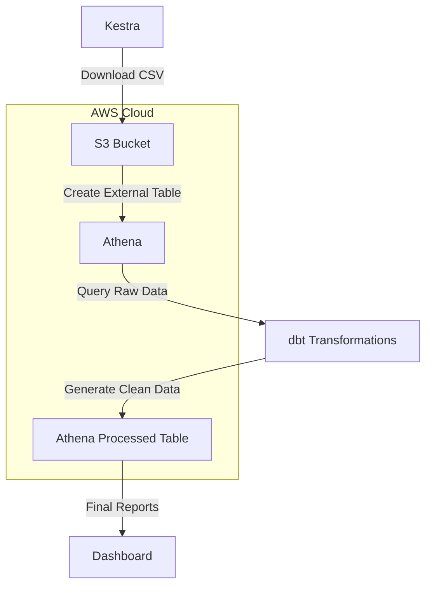
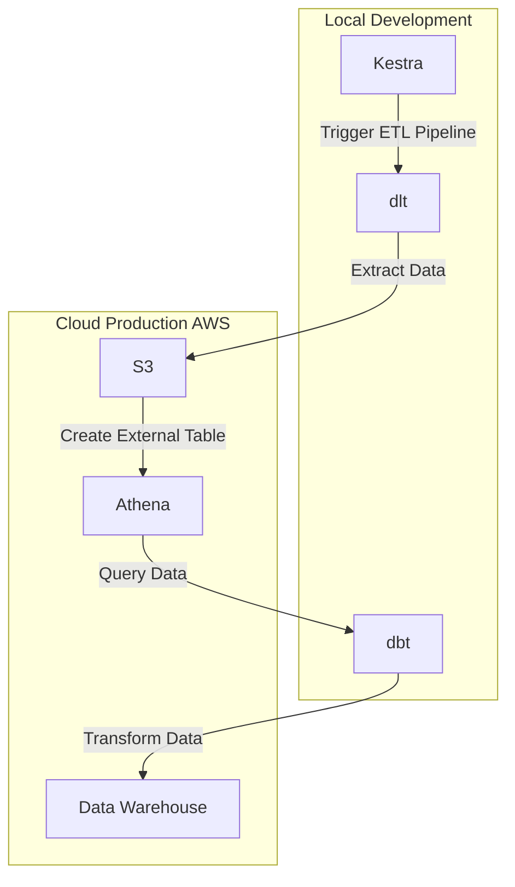
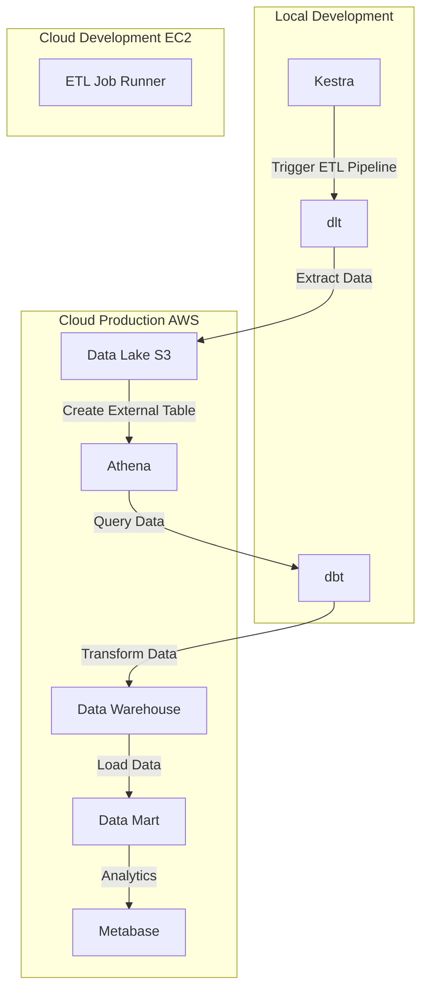
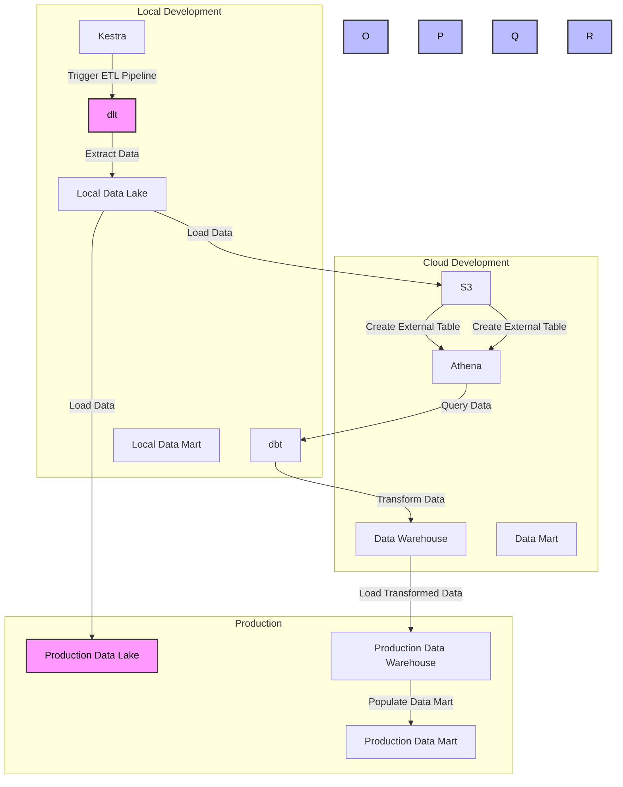

# ELT pipeline with Kestra, Athena, and dbt

To set up your ELT pipeline with Kestra, Athena, and dbt, let’s break it down step by step. We’ll start with extracting data using Kestra and loading it into S3, then move on to querying it with Athena and finally transforming it using dbt.

## Step 1: Extract Data with Kestra and Load to S3

We’ll use **Kestra** to automate the download of the NYC Taxi dataset and upload it to an **S3 bucket**.

### 1.1 Install and Set Up Kestra

You can run Kestra with Docker:

```bash
docker run -p 8080:8080 kestra/kestra
```

Or deploy it in a cloud environment like **AWS**, **ECS** or **EKS**.

### 1.2 Define a Kestra Flow

Create a new Kestra flow (`upload-to-s3.yaml`) to:

1. Download the file from GitHub.
2. Upload it to S3.

```yaml
id: upload_to_s3
namespace: nyc-taxi

tasks:

- id: download_csv
    type: io.kestra.plugin.core.http.Request
    uri: "<https://github.com/DataTalksClub/nyc-tlc-data/releases/download/yellow/yellow_tripdata_2019-01.csv.gz>"
    method: GET
    saveAs: yellow_tripdata_2019-01.csv.gz

- id: upload_to_s3
    type: io.kestra.plugin.aws.s3.Upload
    bucket: my-nyc-taxi-data
    key: raw/yellow_tripdata_2019-01.csv.gz
    region: us-east-1
    from: "{{ outputs.download_csv.uri }}"
```

Run the Kestra flow:

```bash
kestra flow run nyc-taxi/upload-to-s3
```

## Step 2: Query Data in Athena

Now that the file is in S3, we can create an external table in Athena to query it.

### 2.1 Create an Athena Table

```sql
CREATE EXTERNAL TABLE yellow_tripdata (
    VendorID INT,
    tpep_pickup_datetime TIMESTAMP,
    tpep_dropoff_datetime TIMESTAMP,
    passenger_count INT,
    trip_distance DOUBLE,
    total_amount DOUBLE
)
ROW FORMAT SERDE 'org.apache.hadoop.hive.serde2.OpenCSVSerde'
WITH SERDEPROPERTIES (
    "separatorChar" = ",",
    "skip.header.line.count" = "1"
)
LOCATION 's3://my-nyc-taxi-data/raw/'
TBLPROPERTIES ("skip.header.line.count"="1");
```

Verify the table:

```sql
SELECT * FROM yellow_tripdata LIMIT 10;
```

## Step 3: Transform with dbt

### 3.1 Set Up dbt

Modify your `profiles.yml`:

```yaml
nyc_taxi:
  outputs:
    dev:
      type: athena
      s3_staging_dir: s3://my-athena-query-results/
      region: us-east-1
      database: nyc_taxi
  target: dev
```

### 3.2 Create dbt Model

Inside your dbt project (`models/transform_trips.sql`):

```sql
SELECT
    VendorID,
    DATE(tpep_pickup_datetime) AS pickup_date,
    trip_distance,
    total_amount
FROM yellow_tripdata
WHERE trip_distance > 0;
```

Run dbt:

```bash
dbt run
```

## Automation with Terraform

You can automate the **S3 bucket**, **Athena table**, and **Kestra deployment** using Terraform.

### 3.1 Define an S3 Bucket

```hcl
resource "aws_s3_bucket" "nyc_taxi_data" {
  bucket = "my-nyc-taxi-data"
}
````

### 3.2 Set Up Athena Database

```hcl
resource "aws_athena_database" "nyc_taxi" {
  name = "nyc_taxi"
  bucket = aws_s3_bucket.nyc_taxi_data.id
}
```

### 3.3 Deploy Kestra

Use Terraform’s ECS module to deploy Kestra:

```hcl
module "kestra" {
  source  = "terraform-aws-modules/ecs/aws"
  name    = "kestra"
  cpu     = 512
  memory  = 1024
  cluster = aws_ecs_cluster.main.id
}
```

Apply Terraform:

```bash
terraform init
terraform apply
```

What’s Automated?

✅ Data Extraction → Kestra downloads and uploads to S3
✅ Infrastructure → Terraform sets up S3, Athena, and Kestra
✅ Transformations → dbt models process data in Athena

scheduled runs? 🚀







